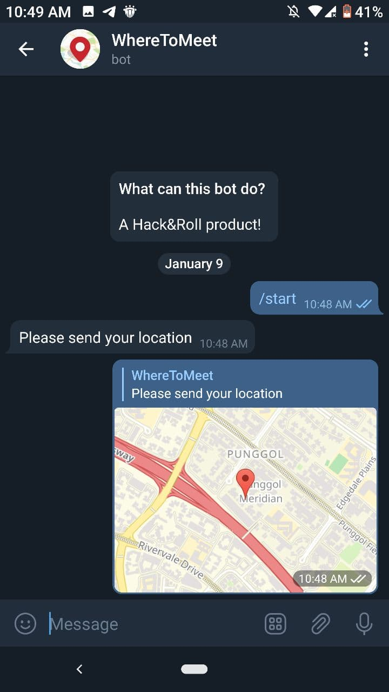
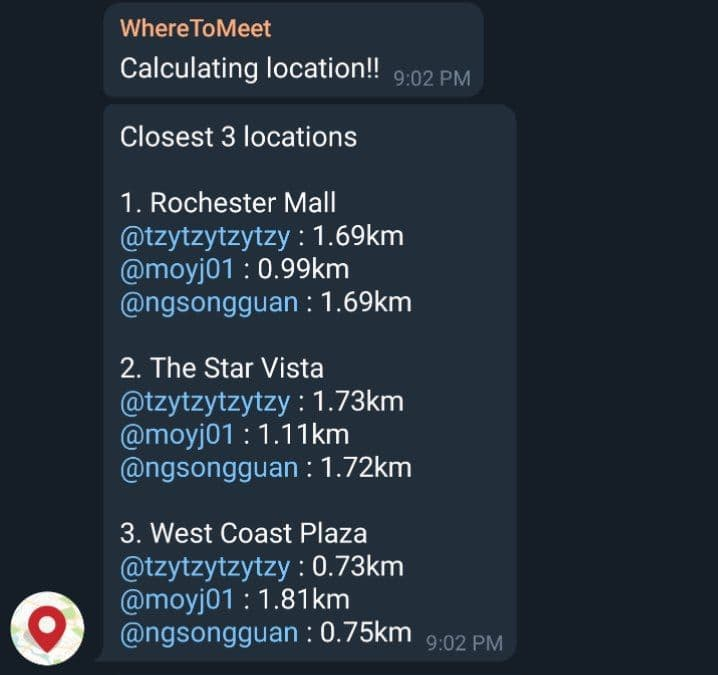

# WheretoMeet

WheretoMeet is a telegram bot that allows you to find convenient locations for you and your friends to meet up. Using a minmax algorithm, WheretoMeet will find the top 3 most convienient locations for you and your friends to meet up.

## Table of Contents

- [WheretoMeet](#wheretomeet)
  - [Table of Contents](#table-of-contents)
  - [Prerequisite](#prerequisite)
  - [Features](#features)
  - [Guide](#guide)
  - [Questions or Feedback](#questions-or-feedback)
  - [Contributors](#contributors)

## Prerequisite

- `@WhereToMeetBot` can only be used within a telegram group

- Users have to initiate a conversation with the bot first before using `@WhereToMeetBot`

## Features

### Mall

This feature allows you to find the nearest mall amongst your friends to meet up. A list of more than 100 shopping malls is included.

### MRT

This feature allows you to find the nearest mrt amongst your friends to meet up. A comprehensive list of all the MRT stations is included.

## Guide

**Steps for using our bot**:

**Step 1**: Add our bot `@WhereToMeetBot` to your telegram group.

**Step 2**: Send `/start@WhereToMeetBot` on the group. The bot will prompt if you would like to find the nearest mall or MRT to meet up.

**Step 3**: Thereafter, the bot will prompt you to `/join@WhereToMeetBot`. Send `/join@WhereToMeetBot` on the group.

**Step 4**: `@WhereToMeetBot` will private message you and all you have to do is share your location.

**Step 5**: After everyone has `/join@WhereToMeetBot` and shared their location. Send `/go@WhereToMeetBot` to find the nearest mall/MRT. 

## Questions or Feedback
If you have questions or have any feedback, do [contact us](mailto:wheretomeet@gmail.com).

## Contributors
- Song Guan
- Melvin Ong
- Tan Zhuo Yao
- Sean Lee
